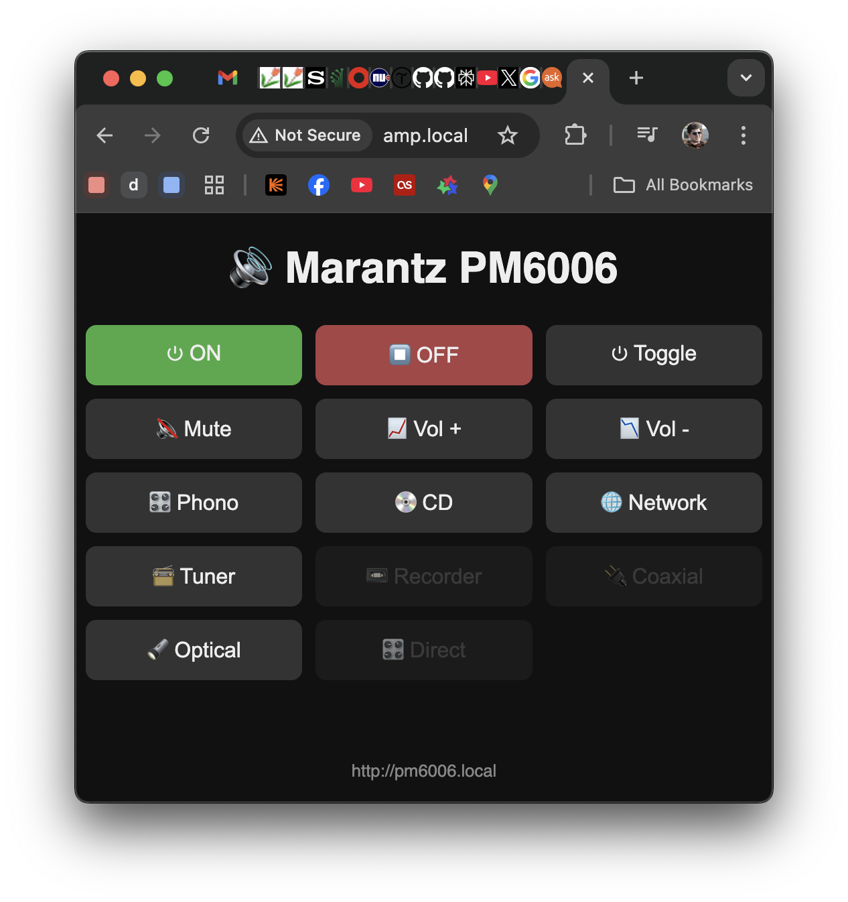

# Marantz PM6006 ESP32 Controller (Integrated with Cambridge Audio MXN10)

This project provides a smart, web-based remote control for the **Marantz PM6006** amplifier using an ESP32. It enables control via a mobile-friendly web interface and integrates with a **Cambridge Audio MXN10** network player to automate power states (Auto-On/Auto-Standby).

The system controls the amplifier via its **Remote In** (RC-5) wired connection, eliminating the need for IR blinkers, while monitoring the MXN10 network player state via UPnP/API to smartly manage the amplifier's power.

## Screenshot

## 🚀 Features

*   **Web Interface**: Clean, mobile-responsive UI with Emojis to control Power, Volume, Inputs, and Mute.
*   **Direct Wired Control**: Sends RC-5 / RC-5 Extended signals directly to the "Remote In" jack (No IR LED required).
*   **Smart Automation**:
    *   **Auto-Wake**: Automatically turns on the Marantz amplifier and selects the correct input when the MXN10 starts playing music.
    *   **Auto-Standby**: Detects when the MXN10 has been idle/stopped for >30 minutes and respects the amplifier's auto-standby logic.
*   **Zero-Config Access**: Accessible via `http://amp.local` (mDNS support).
*   **State Machine**: Robust logic to handle boot-up, pauses, and manual power states without accidental toggling.

## 🛠️ Hardware Requirements

*   **ESP32 Development Board** (e.g., Wemos D1 Mini ESP32, ESP32 DevKit V1)
*   **Marantz PM6006 Amplifier** (or compatible PM-series model)
*   **Cambridge Audio MXN10** (or AXN10) Network Player
*   **Orange RCA Cable** (Mono) for connecting ESP32 to Marantz "Remote In".
*   **Diode**: 1N4148 or similar between ESP32 GPIO and RCA center pin to protect the pin.

### Wiring
Connect the ESP32 GPIO pin (default: `GPIO 32`) through a diode to the **Tip** (Center) of the RCA cable connected to the **Remote In** port on the Marantz. Connect ESP32 **GND** to the RCA **Sleeve** (Outer).

## 📦 Software & Libraries

This project is built using the **Arduino IDE**.

### Required Libraries
*   **ESPAsyncWebServer** - For the non-blocking web interface.
*   **AsyncTCP** - Dependency for async server.
*   **ArduinoJson** - Parsing MXN10 status.
*   **WebSocketsClient** - For real-time MXN10 updates.

### Installation
1.  Clone this repository.
2.  Open the main sketch (`marantz_mxn10.ino`) in Arduino IDE.
3.  Update the configuration at the top of the sketch with your:
    *   `WIFI_SSID` / `WIFI_PASSWORD`
    *   `IR_SEND_PIN`
4.  Flash to ESP32.
5.  Access `http://amp.local` in your browser.

## 🖥️ Web Interface

The interface (`pm6006_web.h`) is a single-file, lightweight HTML/JS solution embedded in the ESP32.
*   **POST Requests**: Uses asynchronous `fetch()` calls (no page reloads).
*   **Status Feedback**: Visual success/error notifications via a floating status bar.
*   **Disabled Buttons**: Inputs not supported by specific firmware versions (like Recorder/Coax) are visually disabled.

## 🤖 Automation Logic

The `processPlaybackStateChange()` function monitors the MXN10:
1.  **Music Starts**:
    *   If coming from `not_ready` (boot) or long idle (>30 mins), sends **Discrete Power ON** and selects **Network Input**.
    *   Resets idle timer.
2.  **Music Stops**:
    *   Starts an internal idle timer.
    *   Does *not* immediately turn off the amp (allows for short pauses).
    *   Logic allows the Marantz's internal Auto-Standby to function naturally.

## 📝 Credits

*   Original inspiration: [SmallHacks - Controlling Marantz Amplifier](https://smallhacks.wordpress.com/2021/07/07/controlling-marantz-amplifier-using-arduino-via-remote-socket/)

## ⚖️ License
MIT License
